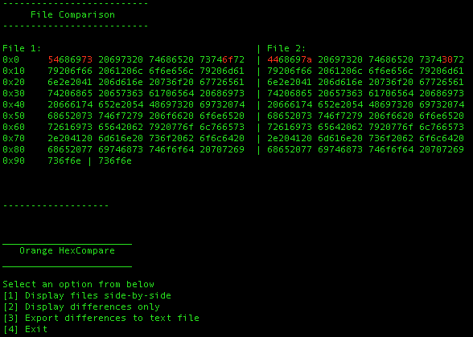

# Orange HexCompare
~~A Visual Hex File Compare Tool written in Python using Kivy~~
(Will be Visual/GUI once I can get Kivy working)

A Terminal-based Hex File compare tool

Since there's no good Hex compare tool I could find for mac, I decided to make my own.

It's currently a work in progress, but the goal is to make it like other popular hex compare tools (HexFiend) but with
greater compatibility and cross-platform

## Features

- [X] Compares files (txt,png,sav,dat,etc.)
- [X] Export differences to a text file
- [ ] Add paging for larger binaries
- [ ] Compares Apps
- [ ] GUI
- [ ] Edit Bytes

## Bugs

* On first load side-by-side view doesn't highlight the differences.
  * Fix: load 'Display differences only' then load 'Display files side-by-side'
