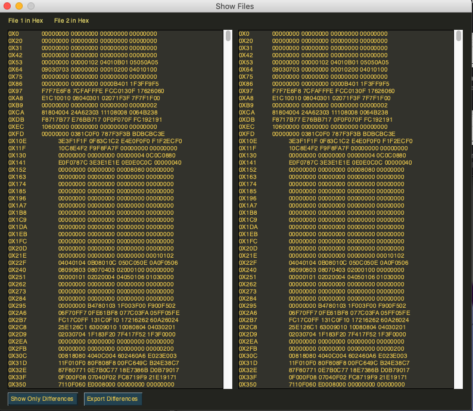

# :tangerine: Orange HexCompare :tangerine:
A Visual Hex File Compare Tool written in Python using PySimpleGUI &

A Terminal-based Hex File compare tool

Since there's no good Hex compare tool I could find for mac (didn't compare side by side accurately), I decided to make my own.

It's currently a work in progress, but the goal is to make it like other popular hex compare tools (HexFiend) but with
greater compatibility and cross-platform

## Dependencies

* [Emoji](https://pypi.org/project/emoji/) (Optional for terminal version)
* [PySimpleGUI](https://pysimplegui.readthedocs.io/en/latest/#install)
  * To Install **PySimpleGUI**:

        pip install pysimplegui
        or
        pip3 install pysimplegui

## Features

- [X] Compares files (txt,png,sav,dat,etc.)
- [X] Export differences to a text file
- [ ] Add paging for larger binaries
- [ ] Compares Apps
- [X] GUI
- [ ] Edit Bytes

## Bugs

* On first load side-by-side view doesn't highlight the differences.
  * Fix: load 'Display differences only' then load 'Display files side-by-side'

## Currently in the works
- [ ] Improve GUI looks
- [ ] Add GUI Themes
- [ ] Fix alignment in GUI
- [ ] Implement 'exporting' on GUI
- [ ] Implement 'show differences' on GUI
